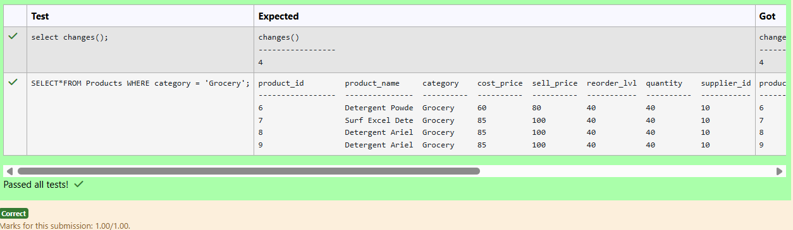
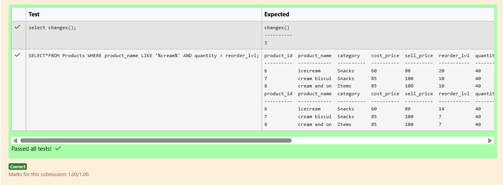
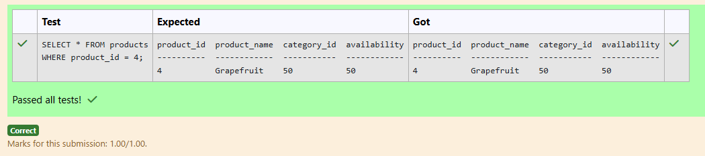
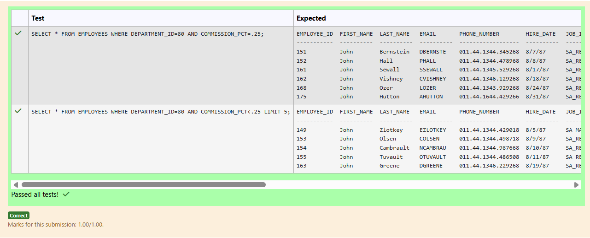
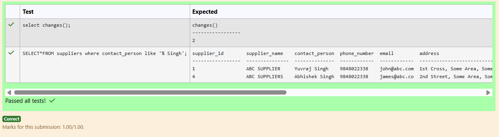
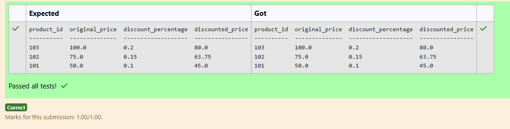
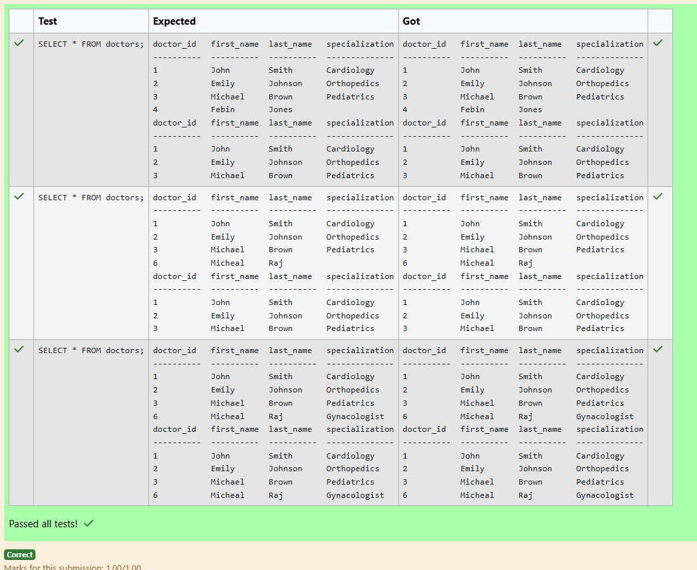
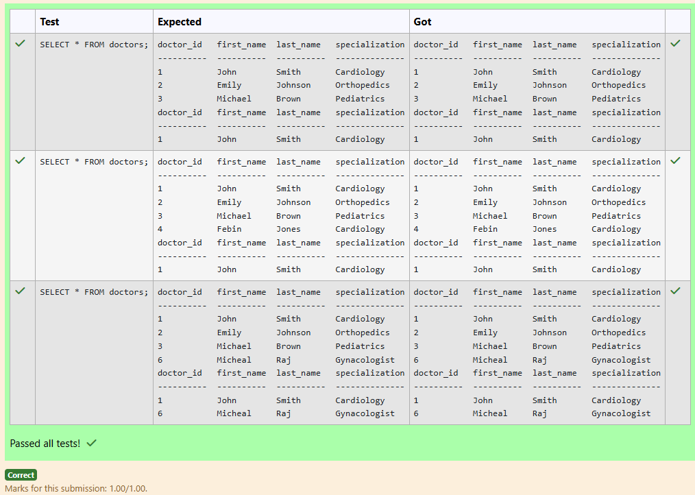
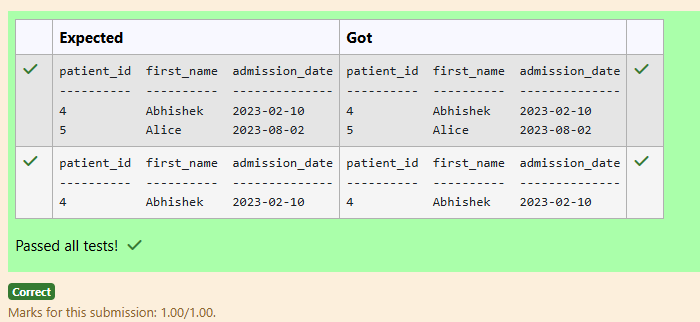
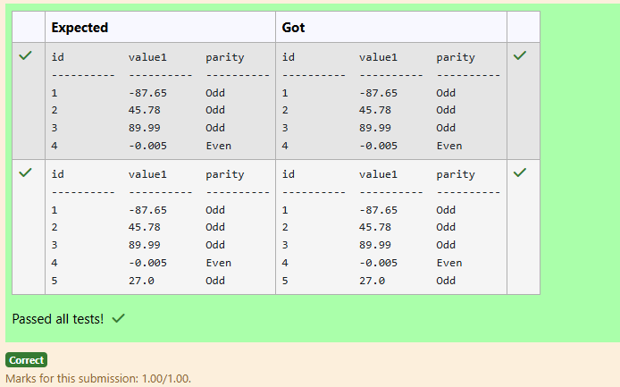

# Experiment 3: DML Commands

## AIM
To study and implement DML (Data Manipulation Language) commands.

## THEORY

### 1. INSERT INTO
Used to add records into a relation.
These are three type of INSERT INTO queries which are as
A)Inserting a single record
**Syntax (Single Row):**
```sql
INSERT INTO table_name (field_1, field_2, ...) VALUES (value_1, value_2, ...);
```
**Syntax (Multiple Rows):**
```sql
INSERT INTO table_name (field_1, field_2, ...) VALUES
(value_1, value_2, ...),
(value_3, value_4, ...);
```
**Syntax (Insert from another table):**
```sql
INSERT INTO table_name SELECT * FROM other_table WHERE condition;
```
### 2. UPDATE
Used to modify records in a relation.
Syntax:
```sql
UPDATE table_name SET column1 = value1, column2 = value2 WHERE condition;
```
### 3. DELETE
Used to delete records from a relation.
**Syntax (All rows):**
```sql
DELETE FROM table_name;
```
**Syntax (Specific condition):**
```sql
DELETE FROM table_name WHERE condition;
```
### 4. SELECT
Used to retrieve records from a table.
**Syntax:**
```sql
SELECT column1, column2 FROM table_name WHERE condition;
```
**Question 1**

Update the reorder level to 40 pieces for all products belonging to the 'Grocery' category in the products table.

```
PRODUCTS TABLE

name               type
-----------------  ---------------
product_id         INT
product_name       VARCHAR(100)
category           VARCHAR(50)
cost_price         DECIMAL(10,2)
sell_price         DECIMAL(10,2)
reorder_lvl        INT
quantity           INT
supplier_id        INT
```

```
update products
set reorder_lvl='40'
where category='Grocery'
```

**Output:**



**Question 2**

 Decrease the reorder level by 30 percent where the product name contains 'cream' and quantity in stock is higher than reorder level in the products table.

```
PRODUCTS TABLE

name               type
-----------------  ---------------
product_id         INT
product_name       VARCHAR(100)
category           VARCHAR(50)
cost_price         DECIMAL(10,2)
sell_price         DECIMAL(10,2)
reorder_lvl        INT
quantity           INT
supplier_id        INT
```

```
update products
set reorder_lvl = reorder_lvl * 0.70
where product_name LIKE '%cream%' AND quantity > reorder_lvl
```

**Output:**



**Question 3**

Write a SQL statement to update the product_name as 'Grapefruit' whose product_id is 4 in the products table.

```
products table

---------------
product_id
product_name
category_id
availability
```

```
update products
set product_name='Grapefruit'
where product_id=4
```

**Output:**



**Question 4**

Write a SQL statement to change the first_name column of employees table with 'John' for those employees whose department_id is 80 and gets a commission_pct below 0.35.

```
Employees table

---------------
employee_id
first_name
last_name
email
phone_number
hire_date
job_id
salary
commission_pct
manager_id
department_id
```

```
update employees
set first_name='John'
where department_id=80 and commission_pct < 0.35
```

**Output:**



**Question 5**

Change the supplier name to upper case where contact person contains ' Singh' in suppliers table.

```
name               type
-----------------  ---------------
supplier_id        INT
supplier_name      VARCHAR(100)
contact_person     VARCHAR(100)
phone_number       VARCHAR(20)
email              VARCHAR(100)
address            VARCHAR(250)
```

```
update suppliers
set supplier_name=UPPER(supplier_name)
where contact_person like '%Singh%'
```

**Output:**



**Question 6**

Write a SQL query to identify the top 3 most expensive discounted products. Return product_id, original_price, discount_percentage, and discounted_price.

Sample table: Products

```
product_id | original_price | discount_percentage

------------+----------------+--------------------- 

101 | 50.00 | 0.10 

102 | 150.00 | 0.15 

103 | 200.00 | 0.20 

104 | 300.00 | 0.25
```

```
select product_id,original_price,discount_percentage,original_price*(1-discount_percentage) as discounted_price
from products
order by discounted_price desc
limit 3;
```

**Output:**



**Question 7**

Write a SQL query to Delete All Doctors with a NULL Specialization

Sample table: Doctors

attributes : doctor_id, first_name, last_name, specialization

```
delete from doctors
where specialization is NULL
```

**Output:**



**Question 8**

Write a SQL query to Delete All Doctors whose ID ranges from 2 to 4.

Sample table: Doctors

attributes : doctor_id, first_name, last_name, specialization

```
delete from doctors
where doctor_id between 2 and 4
```

**Output:**



**Question 9**

Write a SQL query to Select all patients who were admitted during the year 2023.

```
Table: Patients

name                  type
--------------------  ----------
patient_id            INT
first_name            VARCHAR(50)
last_name             VARCHAR(50)
date_of_birth         DATE
admission_date        DATE
discharge_date        DATE
doctor_id             INT
```

```
select patient_id,first_name,admission_date
from patients
where admission_date >= '2023-01-01' AND admission_date <= '2023-12-31';
```

**Output:**



**Question 10**

Write a SQL query to label rows in the Calculations table as 'Even' if value1 is even, otherwise 'Odd'.

```
cid         name        type        notnull     dflt_value  pk
----------  ----------  ----------  ----------  ----------  ----------
0           id          INTEGER     0                       1
1           value1      REAL        0                       0
2           value2      REAL        0                       0
3           base        INTEGER     0                       0
4           exponent    INTEGER     0                       0
5           number      REAL        0                       0
6           decimal     REAL        0                       0
```

```
select id,value1,
case
when value1%2 = 0 then 'Even'
else 'Odd'
end as parity
from Calculations
```

**Output:**



## RESULT
Thus, the SQL queries to implement DML commands have been executed successfully.
