# Experiment 4: Aggregate Functions, Group By and Having Clause

## AIM
To study and implement aggregate functions, GROUP BY, and HAVING clause with suitable examples.

## THEORY

### Aggregate Functions
These perform calculations on a set of values and return a single value.

- **MIN()** – Smallest value  
- **MAX()** – Largest value  
- **COUNT()** – Number of rows  
- **SUM()** – Total of values  
- **AVG()** – Average of values

**Syntax:**
```sql
SELECT AGG_FUNC(column_name) FROM table_name WHERE condition;
```
### GROUP BY
Groups records with the same values in specified columns.
**Syntax:**
```sql
SELECT column_name, AGG_FUNC(column_name)
FROM table_name
GROUP BY column_name;
```
### HAVING
Filters the grouped records based on aggregate conditions.
**Syntax:**
```sql
SELECT column_name, AGG_FUNC(column_name)
FROM table_name
GROUP BY column_name
HAVING condition;
```

**Question 1**

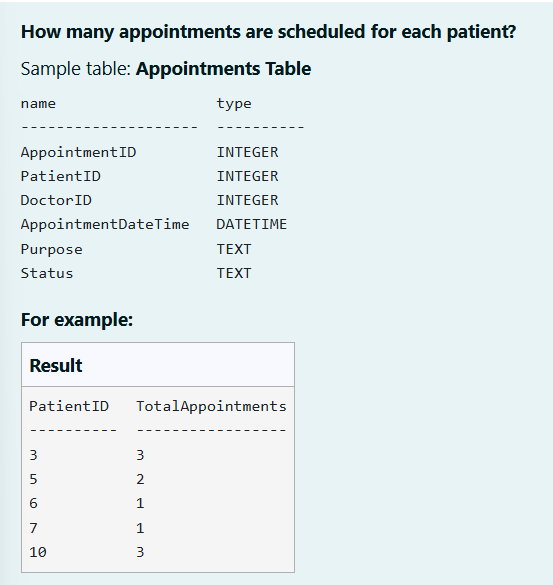

```
SELECT PatientID,
       COUNT(*) AS TotalAppointments
FROM Appointments
GROUP BY PatientID;
```

**Output:**

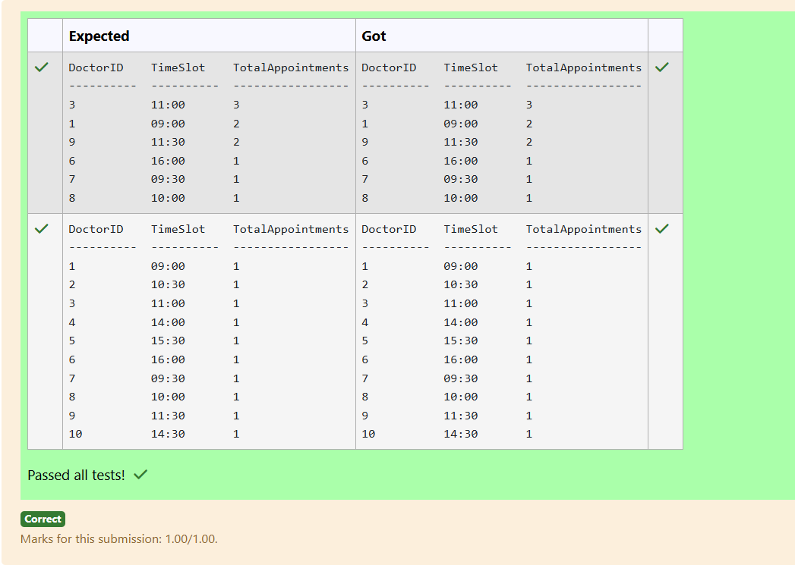

**Question 2**

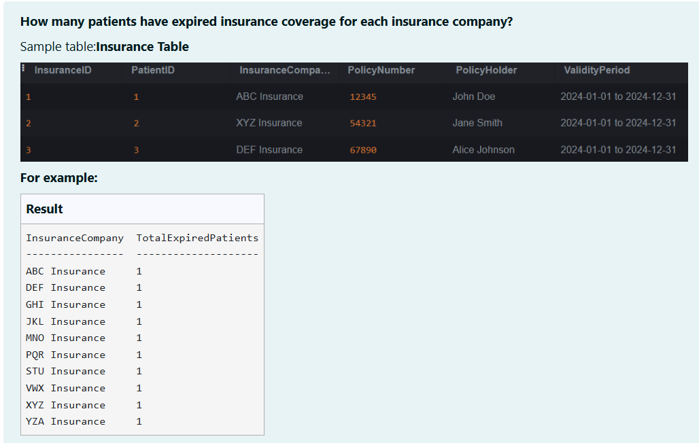

```
SELECT InsuranceCompany,
       COUNT(*) AS TotalExpiredPatients
FROM Insurance
WHERE ValidityPeriod < DATE('now')
GROUP BY InsuranceCompany;
```

**Output:**

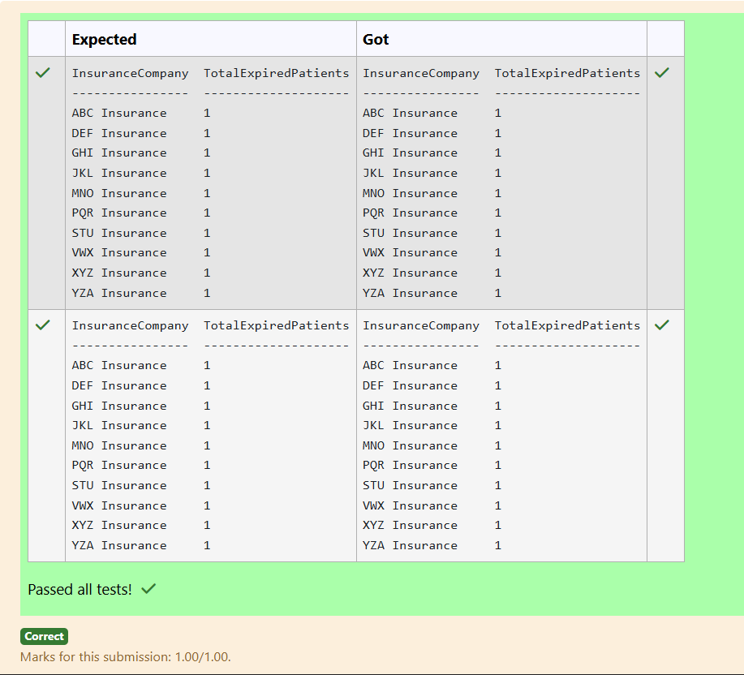

**Question 3**

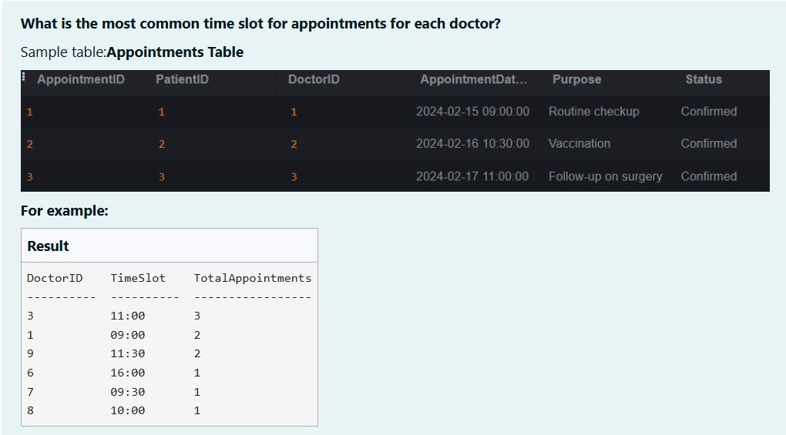

```
SELECT DoctorID,
       strftime('%H:%M', AppointmentDateTime) AS TimeSlot,
       COUNT(*) AS TotalAppointments
FROM Appointments
GROUP BY DoctorID, TimeSlot
HAVING COUNT(*) = (
    SELECT MAX(cnt)
    FROM (
        SELECT COUNT(*) AS cnt
        FROM Appointments a2
        WHERE a2.DoctorID = Appointments.DoctorID
        GROUP BY strftime('%H:%M', a2.AppointmentDateTime)
    )
)
ORDER BY TotalAppointments DESC;
```

**Output:**


**Question 4**

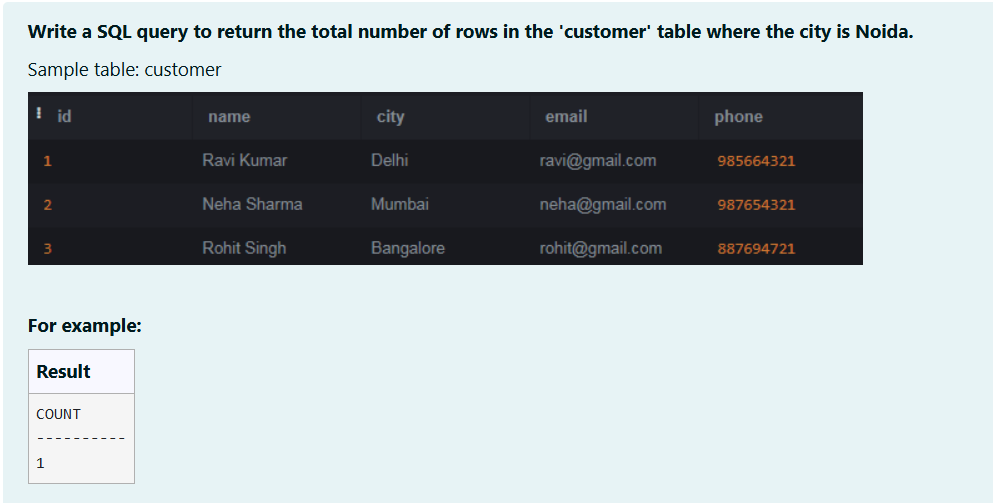

```
SELECT COUNT(*) AS 'COUNT'
FROM customer
WHERE city = 'Noida';
```

**Output:**


**Question 5**

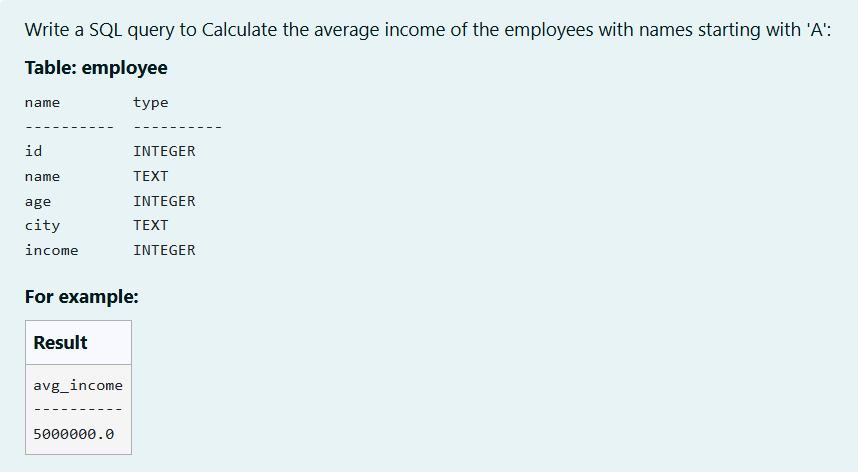

```
SELECT AVG(income) AS avg_income
FROM employee
WHERE name LIKE 'A%';
```

**Output:**

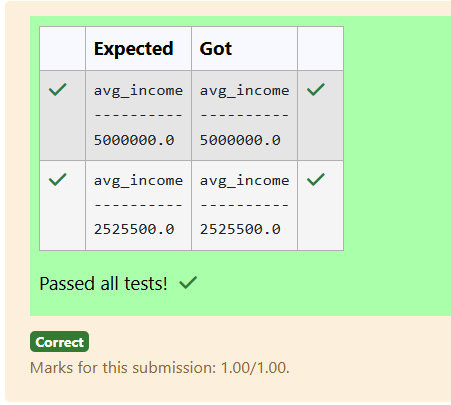

**Question 6**

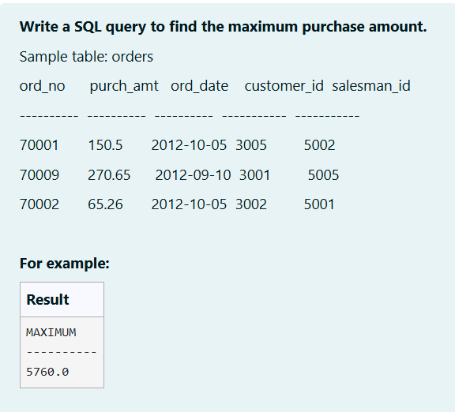

```
SELECT MAX(purch_amt) AS MAXIMUM
FROM orders;
```

**Output:**

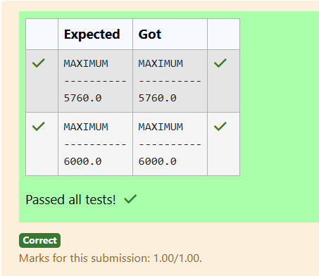

**Question 7**

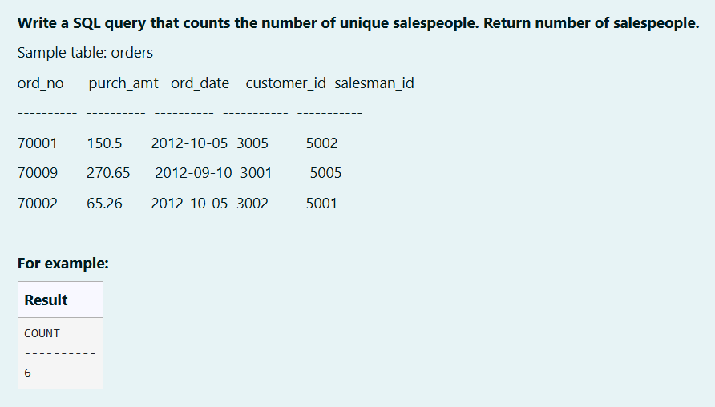

```
SELECT COUNT(DISTINCT salesman_id) AS COUNT
FROM orders;
```

**Output:**

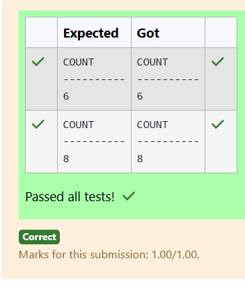

**Question 8**

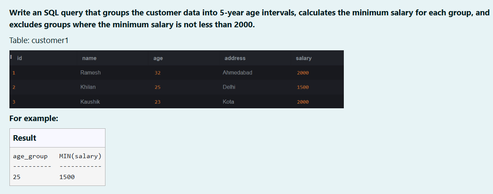

```
SELECT (age / 5) * 5 AS age_group,
       MIN(salary) AS "MIN(salary)"
FROM customer1
GROUP BY (age / 5) * 5
HAVING MIN(salary) < 2000;
```

**Output:**

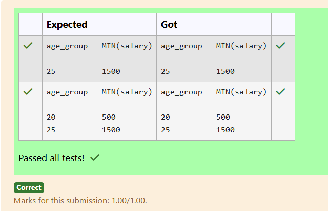

**Question 9**

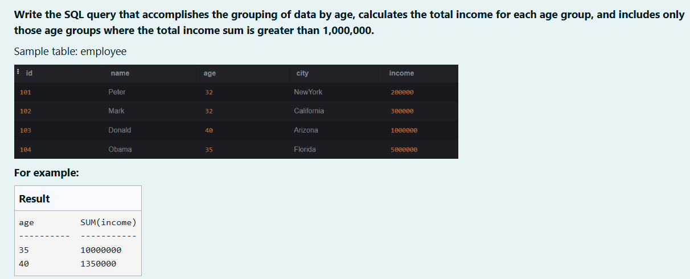

```
SELECT age, SUM(income) AS "SUM(income)"
FROM employee
GROUP BY age
HAVING SUM(income) > 1000000;
```

**Output:**

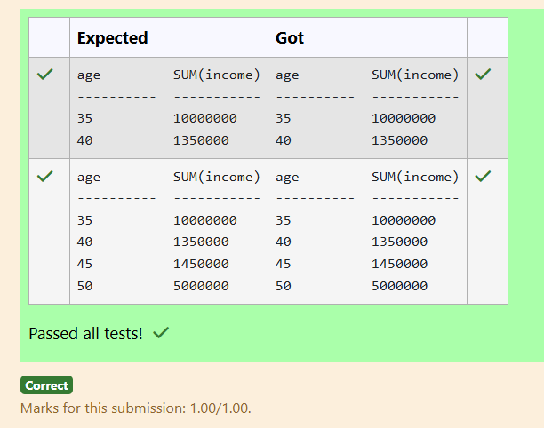

**Question 10**

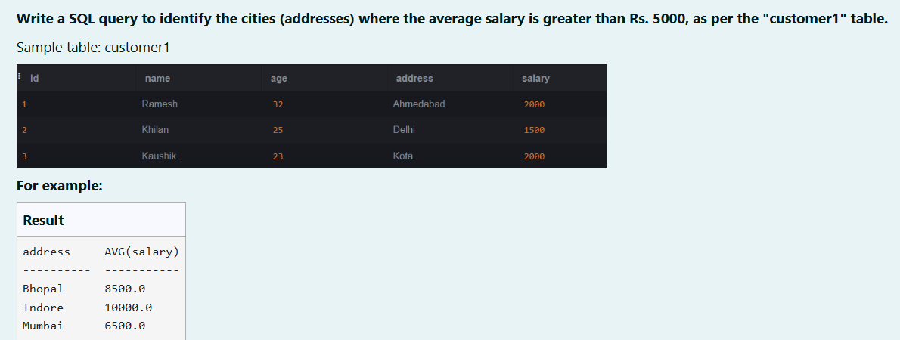

```
SELECT address,
       AVG(salary) AS "AVG(salary)"
FROM customer1
GROUP BY address
HAVING AVG(salary) > 5000;
```

**Output:**

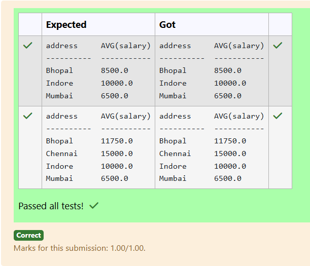


## RESULT
Thus, the SQL queries to implement aggregate functions, GROUP BY, and HAVING clause have been executed successfully.
