# Experiment 5: Subqueries and Views

## AIM
To study and implement subqueries and views.

## THEORY

### Subqueries
A subquery is a query inside another SQL query and is embedded in:
- WHERE clause
- HAVING clause
- FROM clause

**Types:**
- **Single-row subquery**:
  Sub queries can also return more than one value. Such results should be made use along with the operators in and any.
- **Multiple-row subquery**:
  Here more than one subquery is used. These multiple sub queries are combined by means of ‘and’ & ‘or’ keywords.
- **Correlated subquery**:
  A subquery is evaluated once for the entire parent statement whereas a correlated Sub query is evaluated once per row processed by the parent statement.

**Example:**
```sql
SELECT * FROM employees
WHERE salary > (SELECT AVG(salary) FROM employees);
```
### Views
A view is a virtual table based on the result of an SQL SELECT query.
**Create View:**
```sql
CREATE VIEW view_name AS
SELECT column1, column2 FROM table_name WHERE condition;
```
**Drop View:**
```sql
DROP VIEW view_name;
```

**Question 1**

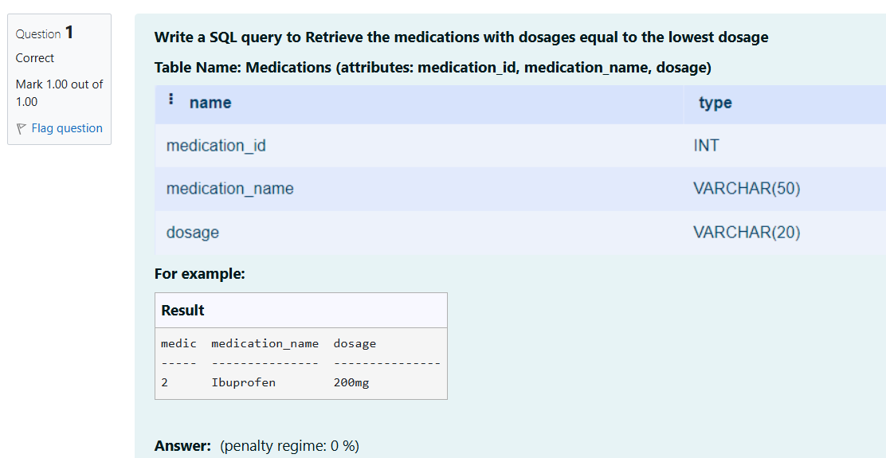

```
select medication_id as medic, medication_name,dosage from Medications 
where dosage = (select min(dosage) from Medications);
```

**Output:**

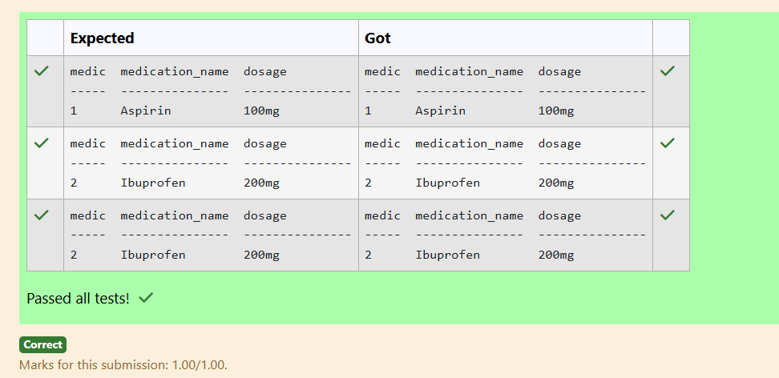

**Question 2**

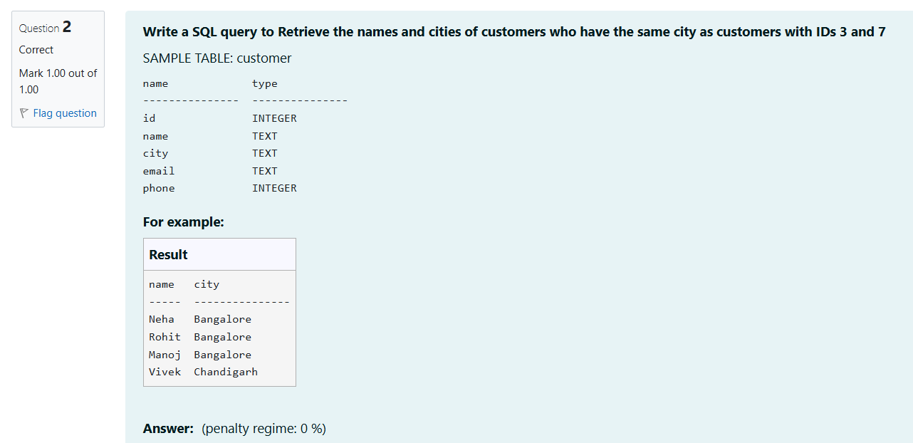

```
select name,city from customer
where city in(select city from customer where id=3 or id=7);
```

**Output:**

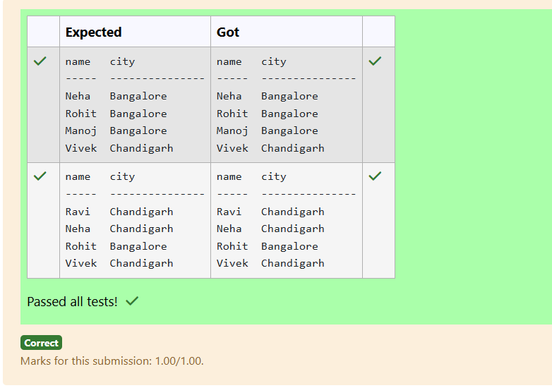

**Question 3**

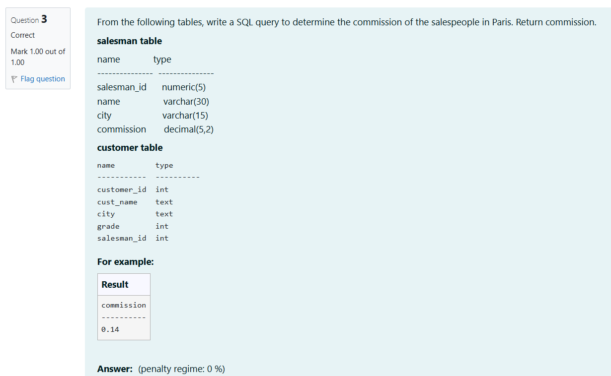

```
SELECT commission
FROM salesman
WHERE salesman_id IN (
    SELECT salesman_id
    FROM customer
    WHERE city = 'Paris'
);
```

**Output:**

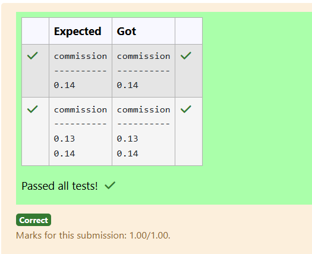

**Question 4**

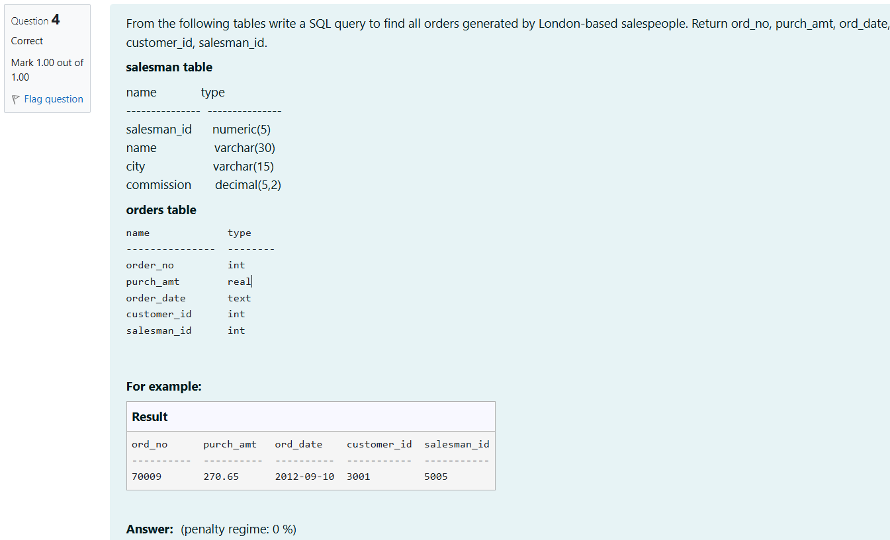

```
select ord_no,purch_amt,ord_date,customer_id,salesman_id from orders where salesman_id in (select salesman_id from salesman where city='London')
```

**Output:**

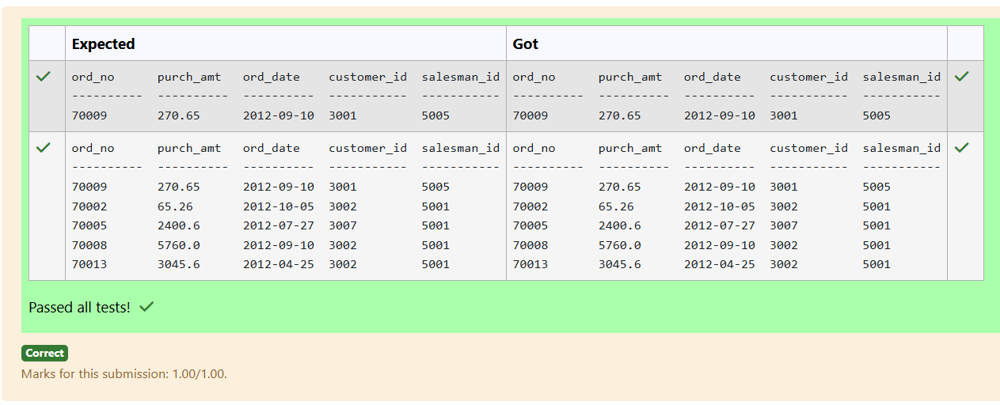

**Question 5**

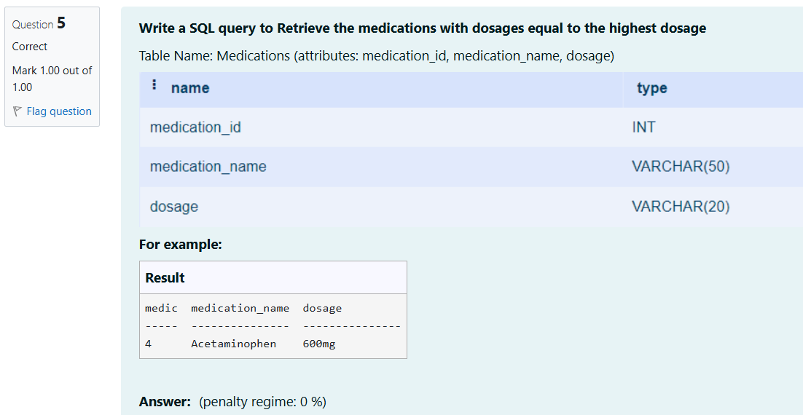

```
select medication_id as medic,medication_name,dosage from Medications where dosage=(select max(dosage) from Medications);
```

**Output:**

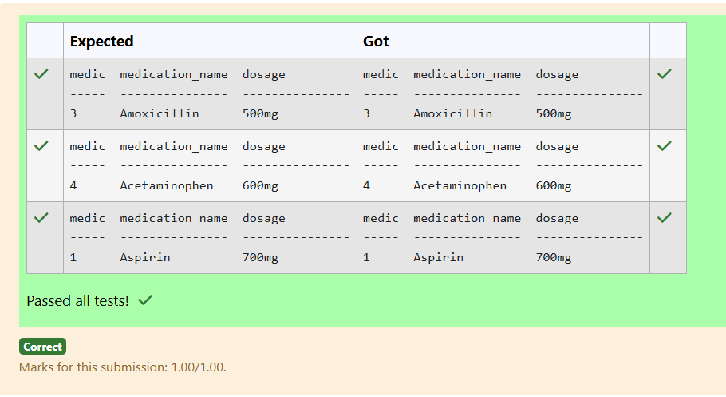

**Question 6**

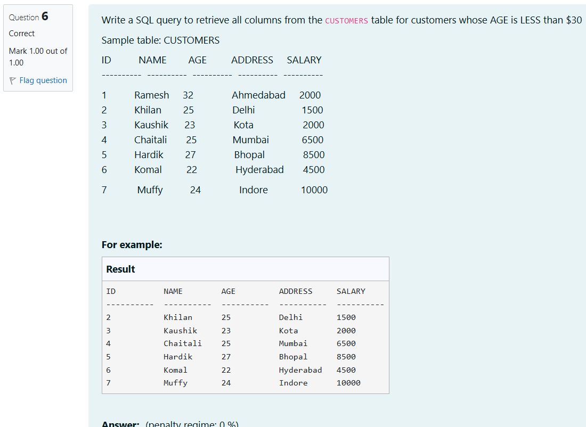

```
select ID,NAME,AGE,ADDRESS,SALARY from CUSTOMERS where AGE<30;
```

**Output:**

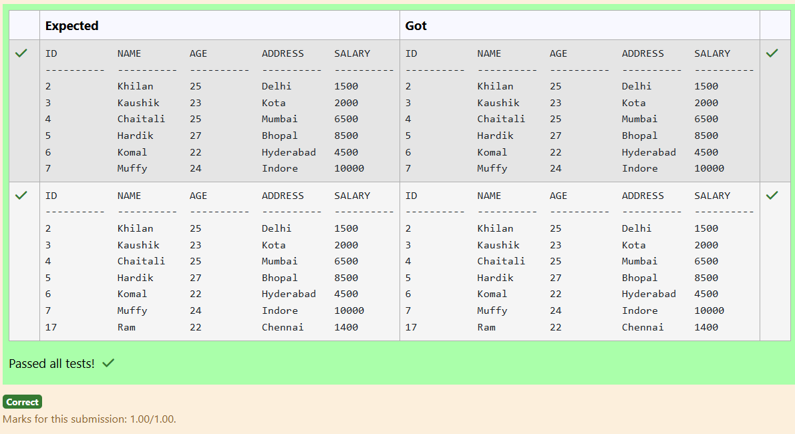

**Question 7**

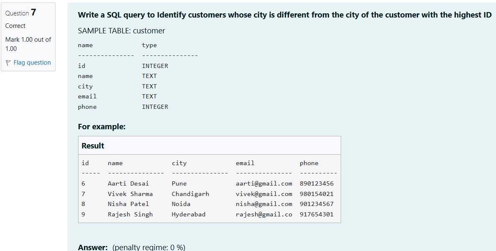

```
select * from customer where city not in(select city from customer where id=(select max(id) from customer))
```

**Output:**

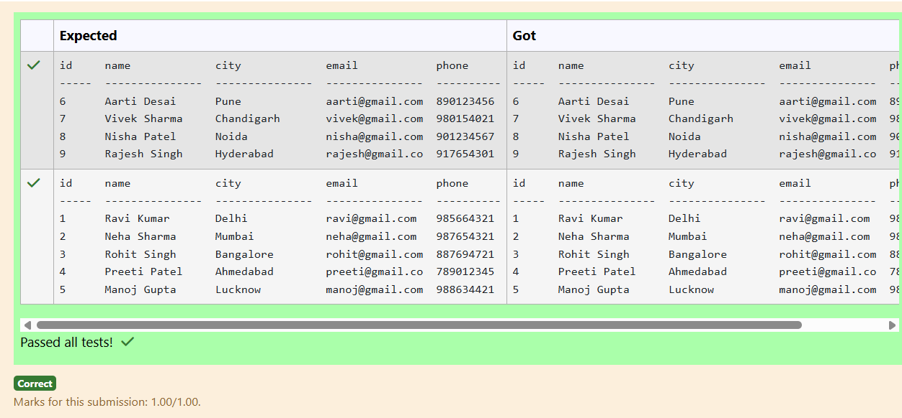

**Question 8**

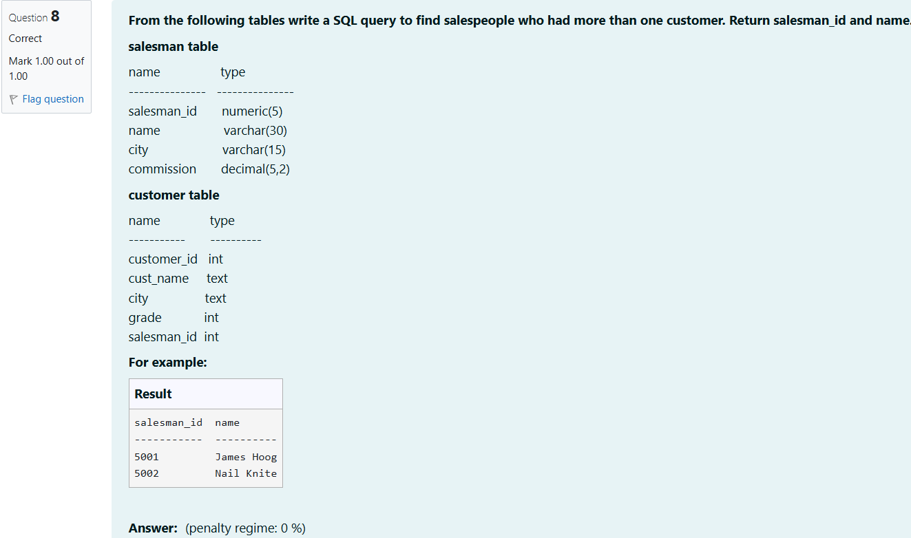

```
SELECT salesman_id, name
FROM salesman
WHERE salesman_id IN (
    SELECT salesman_id
    FROM customer
    GROUP BY salesman_id
    HAVING COUNT(customer_id) > 1
);
```

**Output:**

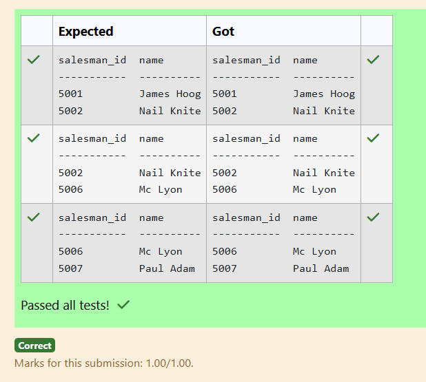

**Question 9**

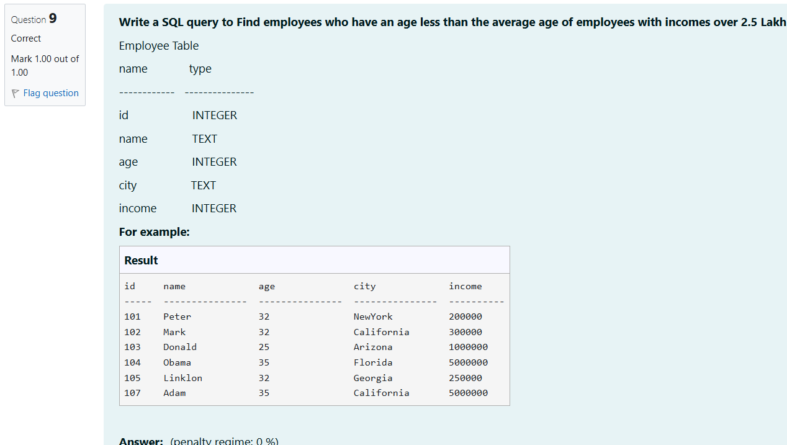

```
select * from Employee where age <(select avg(age) from Employee where income>250000)
```

**Output:**

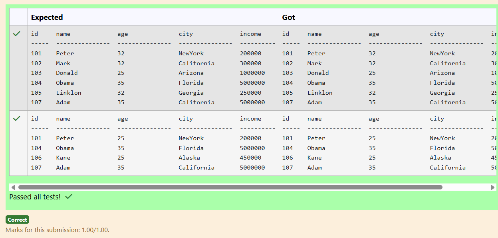

**Question 10**

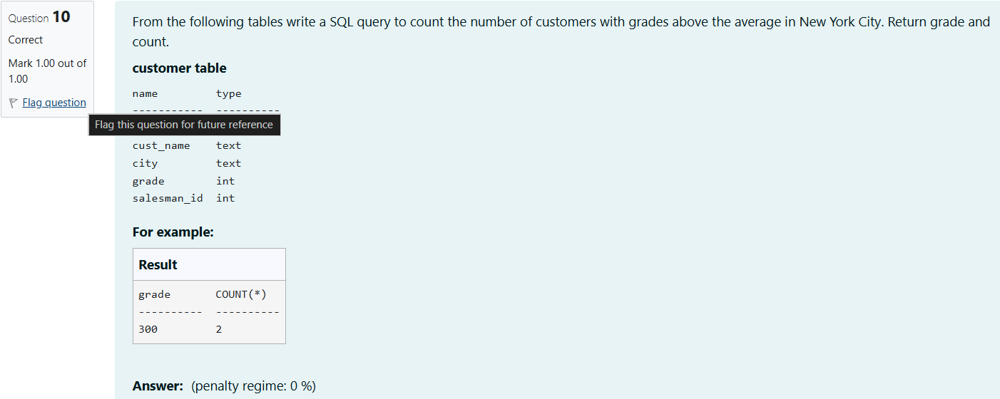

```
select grade, COUNT(*) from customer where grade>(select avg(grade) from customer where city='New York') group by grade;
```

**Output:**

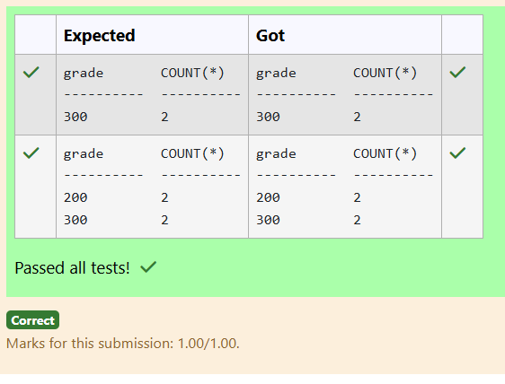


## RESULT
Thus, the SQL queries to implement subqueries and views have been executed successfully.
