# Experiment 6: Joins

## AIM
To study and implement different types of joins.

## THEORY

SQL Joins are used to combine records from two or more tables based on a related column.

### 1. INNER JOIN
Returns records with matching values in both tables.

**Syntax:**
```sql
SELECT columns
FROM table1
INNER JOIN table2
ON table1.column = table2.column;
```

### 2. LEFT JOIN
Returns all records from the left table, and matched records from the right.

**Syntax:**

```sql
SELECT columns
FROM table1
LEFT JOIN table2
ON table1.column = table2.column;
```
### 3. RIGHT JOIN
Returns all records from the right table, and matched records from the left.

**Syntax:**

```sql
SELECT columns
FROM table1
RIGHT JOIN table2
ON table1.column = table2.column;
```
### 4. FULL OUTER JOIN
Returns all records when there is a match in either left or right table.

**Syntax:**

```sql
SELECT columns
FROM table1
FULL OUTER JOIN table2
ON table1.column = table2.column;
```

**Question 1**

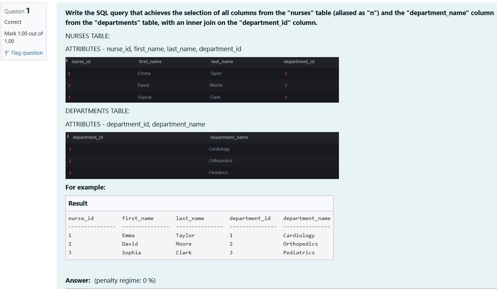

```
select n.*,d.department_name 
from nurses n
inner join departments d
on n.department_id=d.department_id;
```

**Output:**

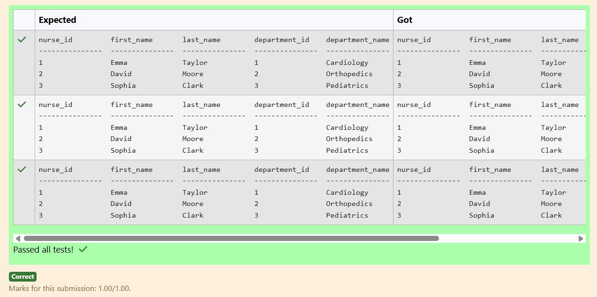

**Question 2**

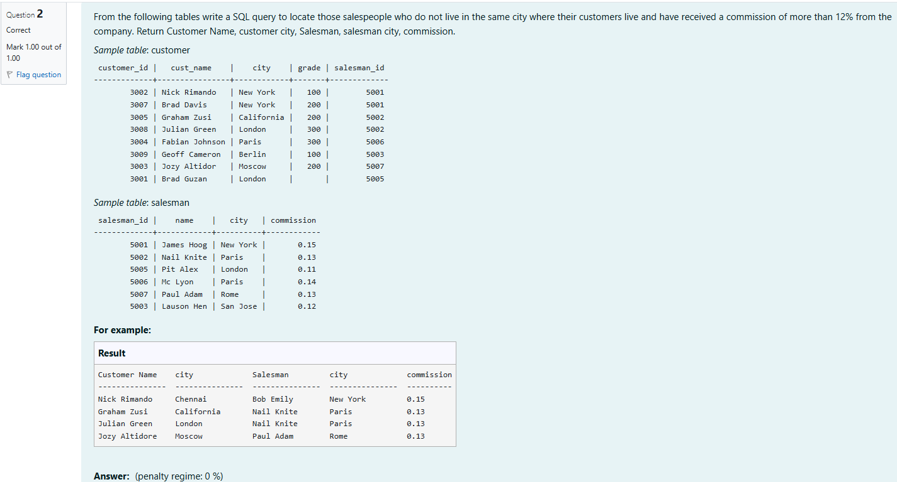

```
select c.cust_name as "Customer Name",c.city,s.name as Salesman,s.city,s.commission
from customer c
inner join salesman s
on c.salesman_id=s.salesman_id
where c.city!=s.city and s.commission>0.12
```

**Output:**

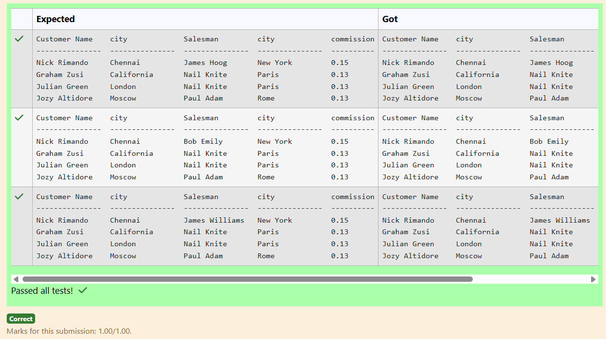

**Question 3**

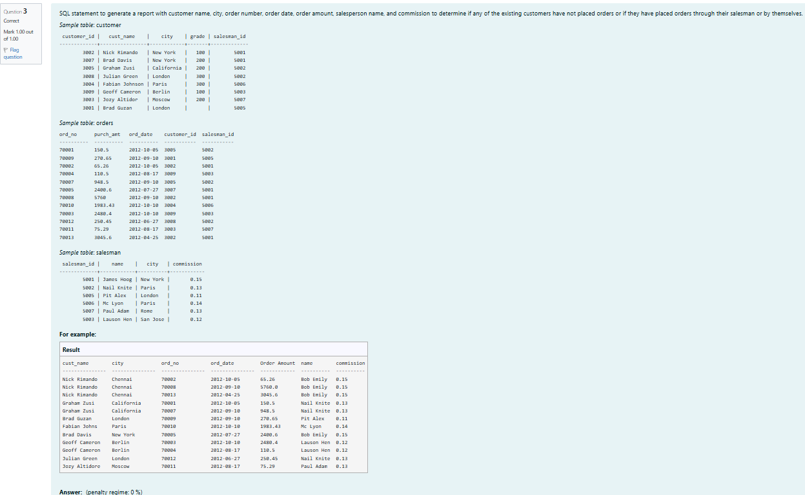

```
select c.cust_name,c.city,o.ord_no,o.ord_date,o.purch_amt as "Order Amount",s.name,s.commission from customer c
left join orders o
on c.customer_id=o.customer_id
left join salesman s
on c.salesman_id=s.salesman_id
```

**Output:**

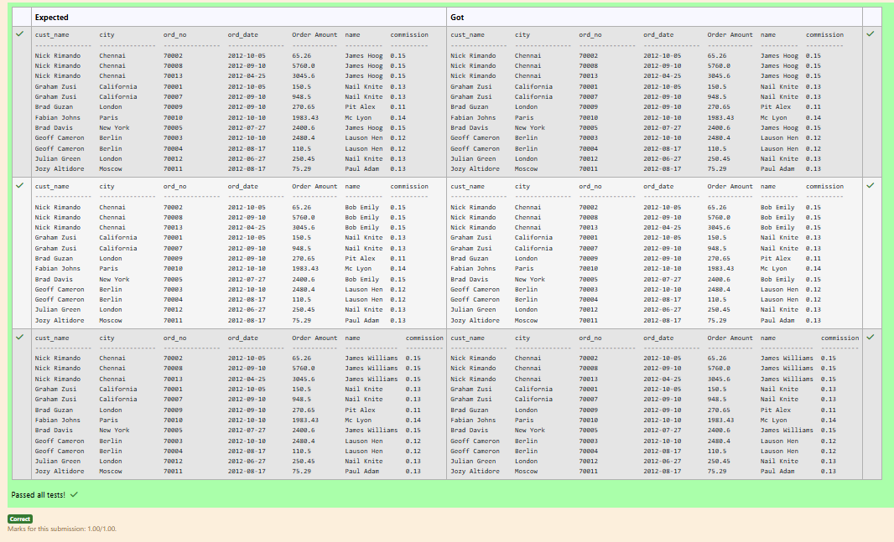

**Question 4**

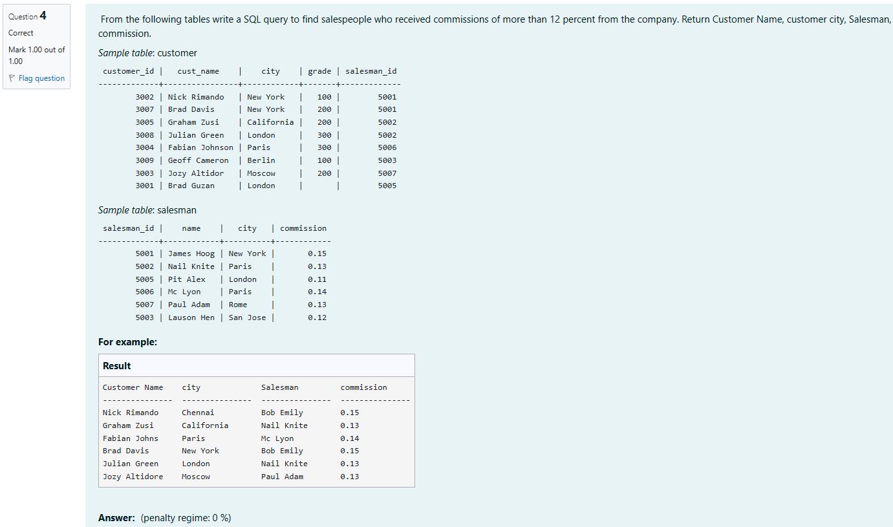

```
select c.cust_name as "Customer Name",c.city,s.name as "Salesman",s.commission from customer c
inner join salesman s
on c.salesman_id=s.salesman_id
where s.commission>0.12;
```

**Output:**

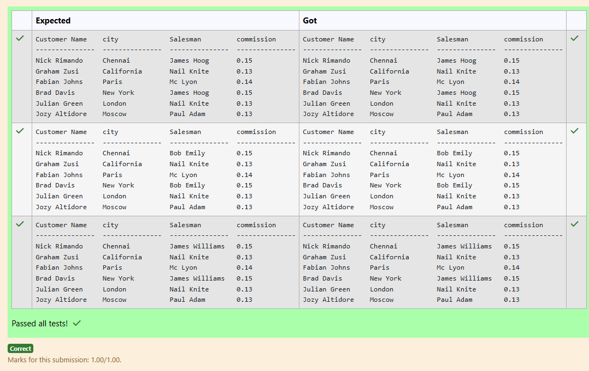

**Question 5**

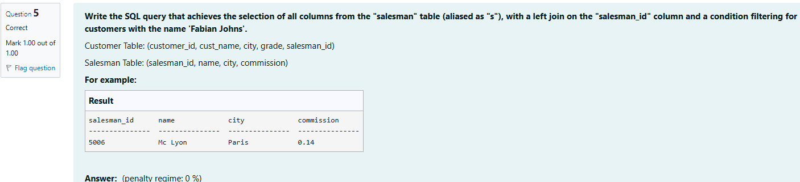

```
select s.salesman_id,s.name,s.city,s.commission from salesman s
left join customer c
on s.salesman_id=c.salesman_id
where c.cust_name='Fabian Johns'
```

**Output:**

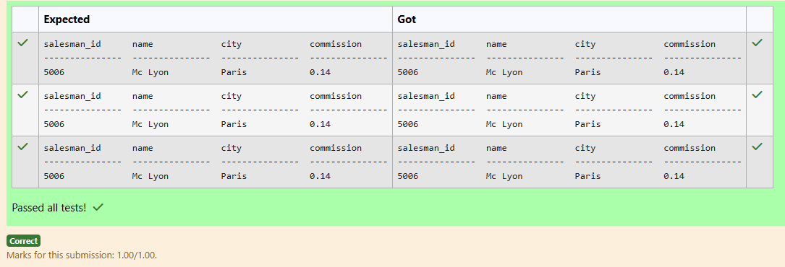

**Question 6**

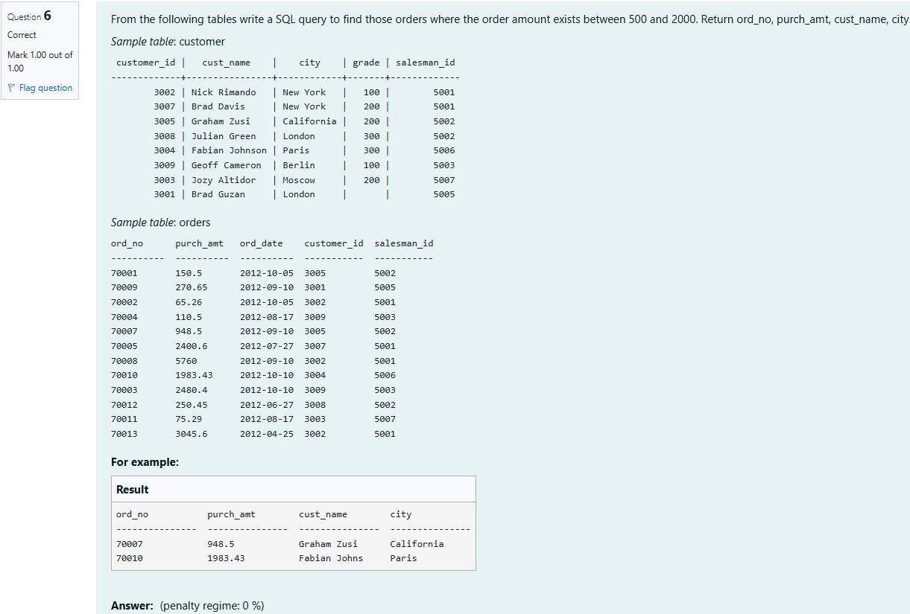

```
select o.ord_no,o.purch_amt,c.cust_name,c.city from orders o
inner join customer c
on o.salesman_id=c.salesman_id
where (o.purch_amt between 500 and 2000) and c.cust_name!='Julian Green'
```

**Output:**

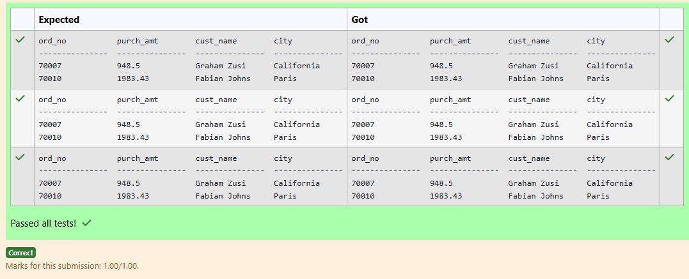

**Question 7**

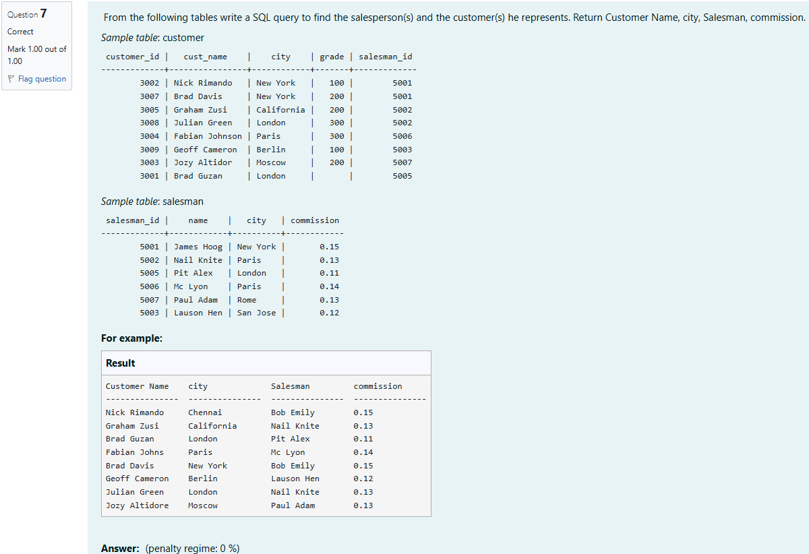

```
select c.cust_name as 'Customer Name', c.city,s.name as Salesman,s.commission from customer c
inner join salesman s
on c.salesman_id=s.salesman_id
```

**Output:**

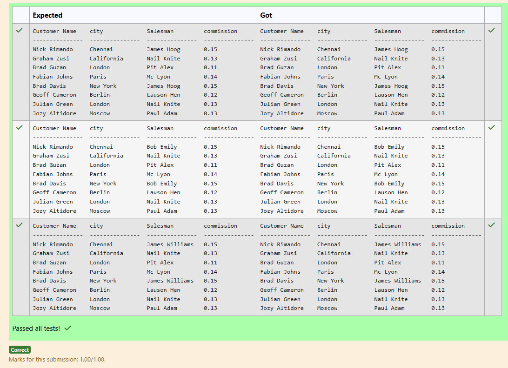

**Question 8**

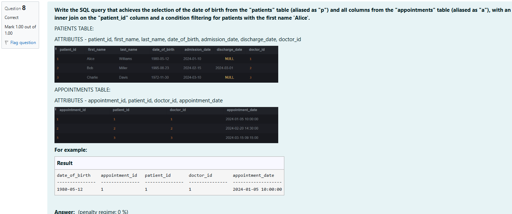

```
select p.date_of_birth,a.appointment_id,a.patient_id,a.doctor_id,a.appointment_date from APPOINTMENTS a
inner join PATIENTS p
on p.patient_id=a.patient_id
where p.first_name='Alice'
```

**Output:**

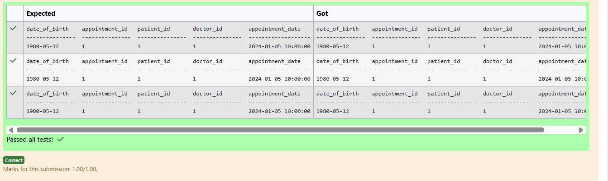

**Question 9**

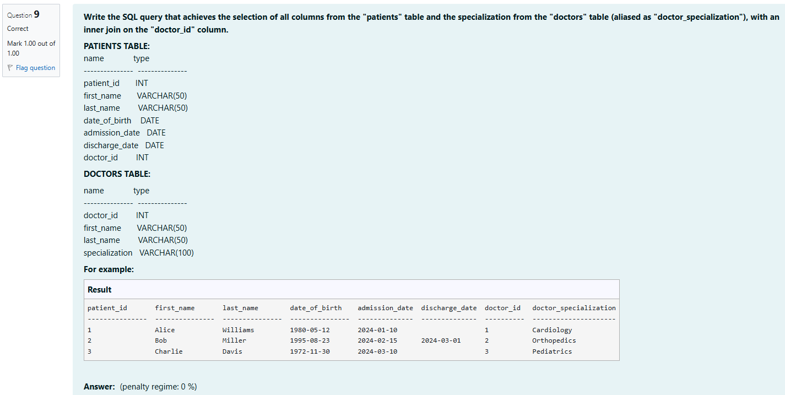

```
select p.patient_id,p.first_name,p.last_name,p.date_of_birth,p.admission_date,p.discharge_date,p.doctor_id,d.specialization as "doctor_specialization"
from PATIENTS p
inner join DOCTORS d
on p.doctor_id=d.doctor_id
```

**Output:**

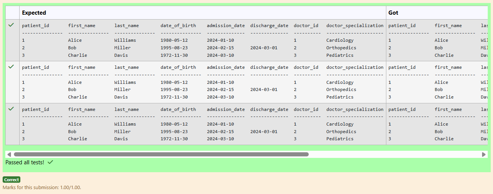

**Question 10**

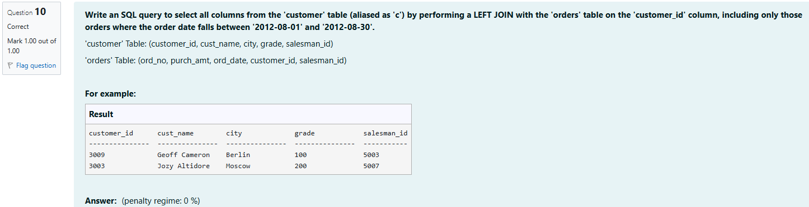

```
select c.customer_id,c.cust_name,c.city,c.grade,c.salesman_id
from customer c
left join orders o
on c.customer_id=o.customer_id 
where o.ord_date between '2012-08-01' and '2012-08-30'
```

**Output:**

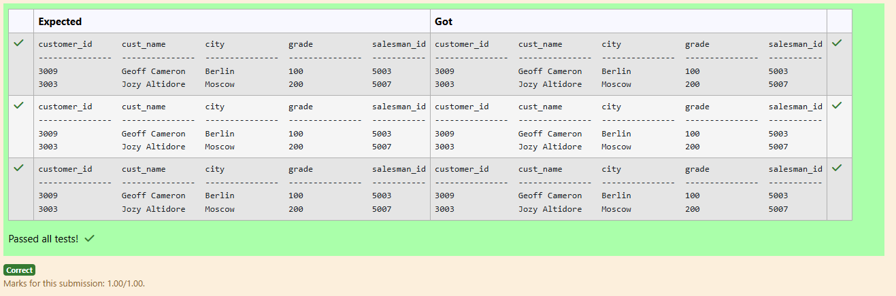


## RESULT
Thus, the SQL queries to implement different types of joins have been executed successfully.
